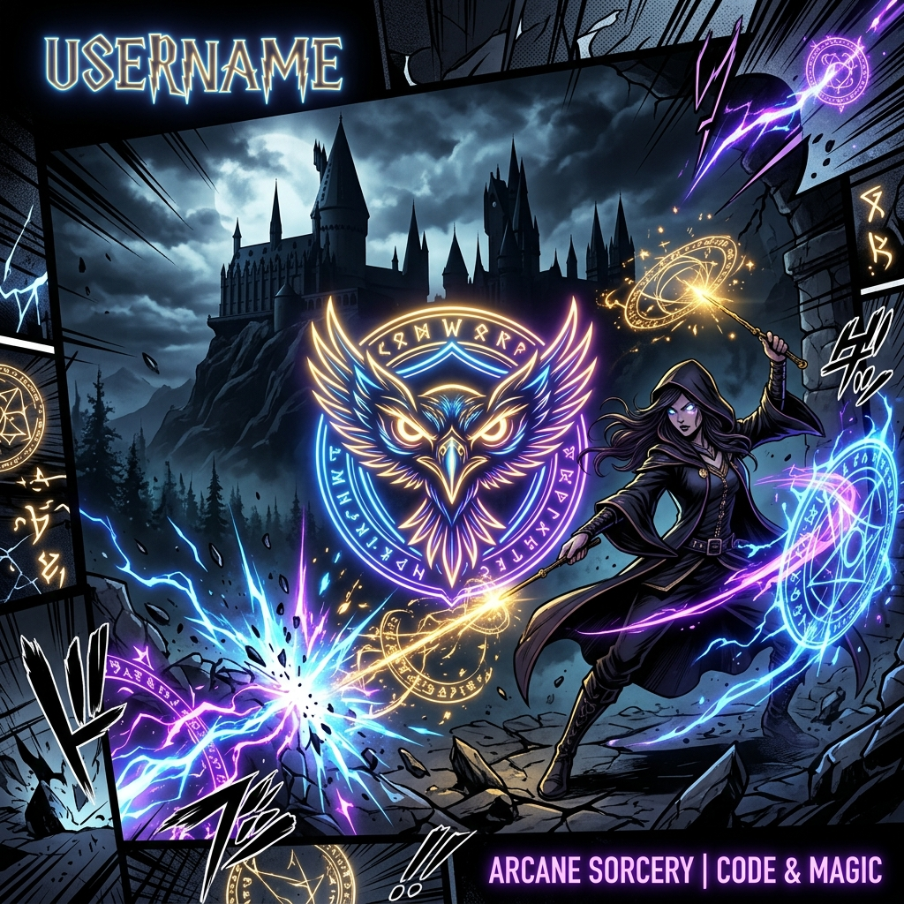

# 🌌 Unlocking the EagleEye's Domain!

  <!-- Dynamic Magical Welcome Banner -->
  

  <!-- Custom Generated Anime/Manhwa/Harry Potter Mashup Banner -->
  

 

---

## 🔮 STATUS WINDOW: THE CHOSEN WIZARD & HUNTER

  <table border="0" cellpadding="10" cellspacing="0" width="100%">
    <tr>
      <!-- Column 1: Hogwarts Student Record -->
      <td width="50%" valign="top" style="border: 2px solid #ffd700; border-radius: 8px; background-color: #0d1117; padding: 15px;">
        <h3 align="center">🏰 HOGWARTS REGISTRY</h3>
        

          
          
        

        <ul>
          <li><strong>Wizarding Rank:</strong> Auror Trainee / Full-Stack Alchemist</li>
          <li><strong>Signature Spell:</strong> <em>Expecto Coding!</em> (Summons clean repositories)</li>
          <li><strong>Marauder's Map Status:</strong> <code>Solemnly Swear That I Am Up To No Good</code> 🐾</li>
        </ul>
      </td>
      <!-- Column 2: System Hunter Status -->
      <td width="50%" valign="top" style="border: 2px solid #00bfff; border-radius: 8px; background-color: #0d1117; padding: 15px;">
        <h3 align="center">🗡️ HUNTER STATUS WINDOW</h3>
        

          
          
        

        <ul>
          <li><strong>Guild:</strong> EagleEye Syndicate 🦅</li>
          <li><strong>Domain Expansion:</strong> <code>Infinite Repositories</code> 🌌</li>
          <li><strong>Awakened Ability:</strong> Rapid Syntactical Transmutation</li>
        </ul>
      </td>
    </tr>
  </table>

---

## 📖 THE SPELLBOOK: MAGICAL ABILITIES (TECH STACK)
*“The wand chooses the wizard, Mr. Potter, but the framework chooses the developer.”*

  
<b>🔴 TRANSMUTATION & CHARMS (Frontend Mastery)</b>

   
  

    
    
    
    
    
    
  

  
<b>🔵 CONJURATION & ALCHEMY (Backend & Core Magic)</b>

   
  

    
    
    
    
  

  
<b>🔮 DEFENSE AGAINST THE DARK ARTS (Tools & Relics)</b>

   
  

    
    
    
    
  

---

## ⚡ DYNAMIC MANA & PERFORMANCE STATS

  <table border="0" cellpadding="0" cellspacing="0">
    <tr>
      <td>
        <!-- Custom Magic Colored GitHub Readme Stats Card -->
        
      </td>
      <td>
        <!-- Custom Magic Colored Streak Stats Card -->
        
      </td>
    </tr>
  </table>

---

## 📖 CURRENTLY BINGING (FAVORITES GRID)
Here are the dynamic portals I am currently traversing across the multiverse!

  <table border="0" cellpadding="5" cellspacing="5" width="100%">
    <tr align="center">
      <td width="20%">
        <strong>🪄 HARRY POTTER</strong> 
         
        <em>Slytherin's Secret</em>
      </td>
      <td width="20%">
        <strong>🗡️ MANHWA</strong> 
         
        <em>Shadow Monarch</em>
      </td>
      <td width="20%">
        <strong>⛩️ ANIME</strong> 
         
        <em>Domain Expansion</em>
      </td>
      <td width="20%">
        <strong>📖 MANGA</strong> 
         
        <em>Hinokami Kagura</em>
      </td>
      <td width="20%">
        <strong>🕷️ COMICS</strong> 
         
        <em>Across the SpiderVerse</em>
      </td>
    </tr>
  </table>

---

## 🦉 SEND AN OWL (GET IN TOUCH)
Feel free to contact my magical messenger owl for collaborations, spell-crafting, or custom code transmutations!

  
  

  <!-- Dynamic visitor counter badge -->
  

