# 🌲 THE GREENWOOD CHRONICLES

  <!-- Dynamic Ethereal Forest Welcome Banner -->
  

    
  

  
<em>“In the depth of the forest, under the damp moss and whispering rain, we weave quiet architectures of order.”</em>

 

  <!-- Breathtaking Forest Vista Sanctuary HUD Window (The Centerpiece) -->
  

  🌿 🌧️ ─── 🌫️ ─── 🌧️ 🌿

 

## 📖 THE WANDERER'S LORE (ABOUT ME)

Welcome to the quiet woods. I am **Kali**, a software craftsman, full-stack architect, and digital wanderer. Much like a forest growing quietly over decades, I build interfaces and database systems that are structured, resilient, and organically cohesive. Guided by a deep appreciation for calm aesthetics, clean design, and structural reliability, I cultivate fluid systems out of raw logic.

From designing highly responsive mobile layouts to structuring scalable cloud databases, I treat coding as a form of natural cultivation—ensuring every component fits seamlessly into a larger, stable ecosystem.

 

## 🌿 THE GREENWOOD CLEARINGS (ACTIVE ARTIFACTS)

*Here are the clearings in my digital forest where active creations and architectural wonders are grown:*

 

  <table border="0" cellpadding="8" cellspacing="8" width="100%" style="border-collapse: separate; border-spacing: 15px; background-color: #050806; border-radius: 16px; border: 1.5px solid #142a20; box-shadow: 0 0 25px rgba(52, 211, 153, 0.15);">
    <tr>
      <!-- Project 1: Banking Remake -->
      <td width="33%" valign="top" style="background: rgba(110, 231, 183, 0.03); border-radius: 12px; border: 1.5px solid #2d5a45; padding: 20px;">
        💰 
        <strong>Aetherial Banking Core</strong>
        

        
          A high-fidelity mobile finance system featuring custom-designed ledger sheets, highly responsive transaction state cycles, and a stable PDF generator for accounts.
        
      </td>
      <!-- Project 2: Greenwood Vista -->
      <td width="33%" valign="top" style="background: rgba(110, 231, 183, 0.03); border-radius: 12px; border: 1.5px solid #2d5a45; padding: 20px;">
        🌲 
        <strong>Greenwood Gateway</strong>
        

        
          An immersive vector canvas showcasing moving mountain mist, diagonal wind-swept rainfall, and swaying ferns at the base. Combines organic natural assets inside clean markdown frameworks.
        
      </td>
      <!-- Project 3: Intel Engine -->
      <td width="33%" valign="top" style="background: rgba(110, 231, 183, 0.03); border-radius: 12px; border: 1.5px solid #2d5a45; padding: 20px;">
        🧪 
        <strong>Forest Intel Engine</strong>
        

        
          An automated workspace coordinator that maps folder hierarchies, automates complex git procedures, and deploys structural layouts with absolute correctness.
        
      </td>
    </tr>
  </table>

 

  🌿 ⋆ ✦ ─── ✦ ⋆ 🌿

 

## 🌿 THE GREENWOOD FLORA: SKILLS (TECH STACK)

*The natural domains and layers where my technical tools take root:*

 

  <table border="0" cellpadding="10" cellspacing="10" width="100%" style="border-collapse: separate; border-spacing: 15px; background: transparent;">
    <tr>
      <!-- Left Panel: Frontend Lush Undergrowth -->
      <td width="50%" valign="top" style="background: rgba(110, 231, 183, 0.03); border-radius: 16px; border: 1.5px solid #2d5a45; padding: 20px; box-shadow: 0 0 15px rgba(52, 211, 153, 0.05);">
        <h3 align="center">🌿 LUSH UNDERGROWTH</h3>
        
<em>Cultivating fluid, interactive responsive interfaces (Frontend)</em>

         
        

          
          
          
          
          
          
        

      </td>
      <!-- Right Panel: Backend Deep Roots -->
      <td width="50%" valign="top" style="background: rgba(110, 231, 183, 0.03); border-radius: 16px; border: 1.5px solid #2d5a45; padding: 20px; box-shadow: 0 0 15px rgba(52, 211, 153, 0.05);">
        <h3 align="center">🌲 DEEP ROOTS</h3>
        
<em>Structuring logic flow and data ecosystems (Backend)</em>

         
        

          
          
          
          
        

      </td>
    </tr>
    <tr>
      <!-- Full-Width Bottom Panel: Wards & Tools -->
      <td colspan="2" valign="top" style="background: rgba(110, 231, 183, 0.03); border-radius: 16px; border: 1.5px solid #142a20; padding: 20px; box-shadow: 0 0 15px rgba(20, 42, 32, 0.05);">
        <h3 align="center">🛡️ ANCIENT WARDS & WOVEN VINES</h3>
        
<em>Alchemical relics, wards, and version control tools</em>

         
        

          
          
          
          
        

      </td>
    </tr>
  </table>

 

  🌿 🌫️ ─── 🌌 ─── 🌫️ 🌿

 

## 📊 CELESTIAL RAINFALL & PERFORMANCE STATS

  <table border="0" cellpadding="0" cellspacing="0" style="border-collapse: collapse; border: none; background: transparent;">
    <tr>
      <td style="padding: 10px; border: none;">
        <!-- Custom Magic Colored GitHub Readme Stats Card -->
        
      </td>
      <td style="padding: 10px; border: none;">
        <!-- Custom Magic Colored Streak Stats Card -->
        
      </td>
    </tr>
  </table>

 

  🌿 🌧️ ─── 🌫️ ─── 🌧️ 🌿

 

## 🦉 SEND AN OWL (TELEPATHIC CHANNEL)

*Feel free to open a telepathic channel through the misty woods for collaborations or custom systems:*

 

  

    
    &nbsp;&nbsp;&nbsp;
    
  

   
  <!-- Dynamic visitor counter badge wrapped in portal magic -->
  

    
  

